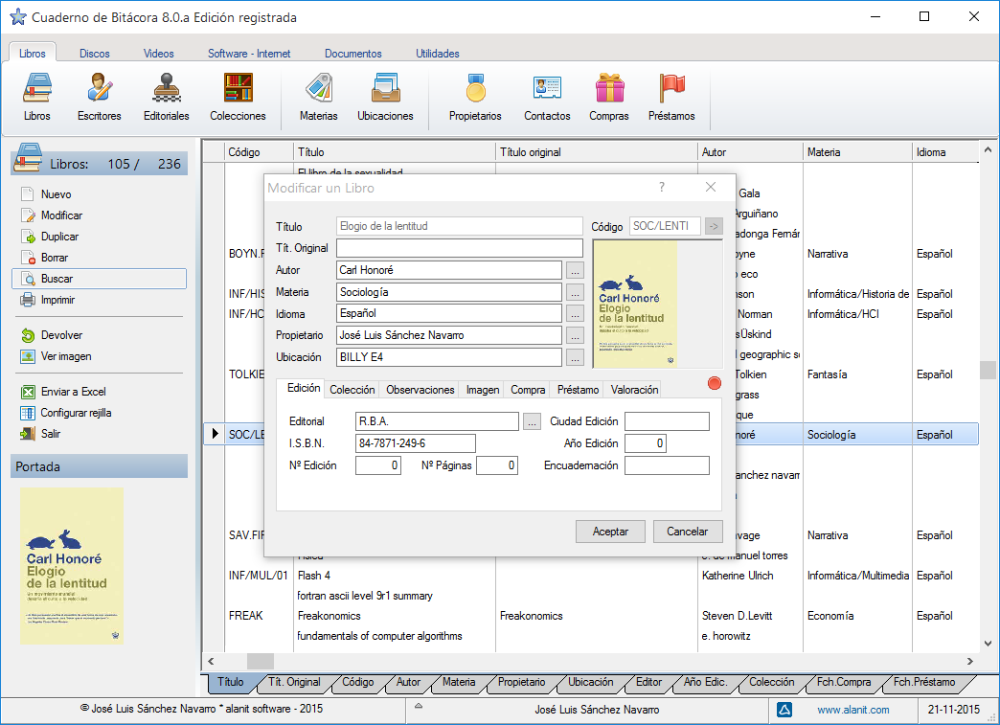

# Cuaderno de bitácora
Fuentes del programa Cuaderno de Bitácora: http://www.alanit.com/software/cuaderno-de-bitacora/

Cuaderno de Bitácora es un **organizador personal de libros, discos, vídeos, software, direcciones de internet y documentos**. Tiene funciones de búsqueda por múltiples críterios que son de gran utilidad a la hora de querer localizar un determinado ejemplar, y posee un recordatorio de préstamos de muy fácil uso. Incorpora ficheros de autores, editoriales, productoras de discos y vídeos, compañías de software, idiomas, y colecciones de todos los tipos. Además permite clasificar tus colecciones por materias y por ubicaciones. El programa se completa con un nuevo generador de listados completamente configurable.

Esta aplicación requiere Borland C, Harbour y FivewinHarbour para compilarse. Yo uso FWH 19.05 y la versión correspondiente de Harbour empaquetada por Fivetech. Para compilar el programa hay que make btc1905 que compila los fuentes y crea el ejecutable.

Mi editor es HippoEdit y el archivo bitacora.heprj es el archivo de proyecto para ese editor.

La estructura de carpetas de la aplicación es la siguiente:

* ch - contiene archivos de cabecera del preprocesador
* datos - contiene datos de ejemplo del programa
* makefile - contiene los archivos de compilación y enlazado
* prg - contiene los fuentes del programa. No están todos los fuentes debido a que uso modificaciones a medida de FivewinHarbour y esos fuentes no son públicos.

Para cualquier consulta escribirme a [joseluis@alanit.com](mailto:joseluis@alanit.com)

Novelda, agosto de 2019. José Luis Sánchez Navarro

